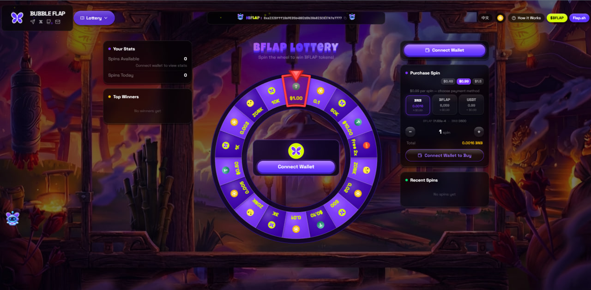

#  BubbleFlap — Real-Time Token Bubble Visualizer

[get $BFLAP](https://bubbleflap.fun/bswap)

**A stunning real-time token visualizer and trading platform for the BSC/BNB blockchain.**

**0xa2320fff1069ed5b4b02ddb386823e837a7e7777**

**Watch tokens come alive as physics-based floating bubbles — sized by market cap, updated in real-time.**

[Live Demo](https://bubbleflap.fun) · [Report Bug](https://github.com/bubbleflap/BubbleFlap-RealtimeTokenBubble-WebApplication/issues) · [Request Feature](https://github.com/bubbleflap/BubbleFlap-RealtimeTokenBubble-WebApplication/issues) [**WE LOVE FLAP.SH**](https://flap.sh/)

---

## ✨ Features

### 🫧 Interactive Bubble Canvas
- **Physics-based floating bubbles** with drift, repulsion, and center gravity
- **Market cap-based sizing** — bigger bubbles = bigger market cap
- **Direct DOM rendering via requestAnimationFrame** for smooth 60fps animation across 100+ tokens
- **Scroll-to-zoom**, drag-to-pan, pinch-to-zoom on mobile
- **Smooth organic movement** inspired by wump.fun
- **Database-backed token caching** — up to 100 tokens displayed (live API + DB history)

### 📊 Real On-Chain Data
- Live token data from **Flap.sh GraphQL API** (BSC/BNB chain)
- **On-chain graduation detection** via LaunchedToDEX events from Flap.sh Portal contract
- **DexScreener data enrichment** — live market cap, volume, liquidity for all graduated tokens
- **Market Cap, Price, Holders, Dev Hold %, Burn %, Tax** — all real blockchain data
- BNB price from **Binance API** for accurate USD conversion
- Token images via **IPFS/Pinata** gateway
- **Scam/rug filter** — tokens under $3K mcap auto-removed from graduated list

### 📱 Multiple Views
| View | Description |
|------|-------------|
| **New Tokens** | Up to 100 freshly created tokens with NEW detection (15s glow animation), database caching for history |
| **Recent Bonding** | Top 60 recently graduated tokens detected via on-chain LaunchedToDEX events, enriched with DexScreener data |
| **Dex Paid** | Dual-source discovery: Flap.sh API + DexScreener search, merged and deduplicated |
| **BFlapSwap** | Built-in DEX aggregator for instant token swapping |
| **Volume Bot** | Automated volume generation tool with gas optimization |
| **BFLAP Lottery** | On-chain spin-the-wheel lottery powered by BFLAP tokens — win BNB prizes every round |
| **BFLAP Staking** | Stake BFLAP across three on-chain pools — Flexible 60%, 7-Day 90%, 15-Day 140% APY |
| **Whitepaper** | Project documentation, vision, and roadmap |

### 🤖 AI Chatbot — Bot Bubble Flap
- Powered by **Claude AI** (Anthropic)
- Token analysis, contract address lookup
- Rich token cards with on-chain data
- Quick Swap button — opens BFlapSwap with token pre-filled
- Multilingual support (English / 中文)

### 🔥 NEW Token Detection
- Newly created tokens appear as **max-size centered bubbles**
- **Red pulsing glow** + "NEW" badge for 15 seconds
- Multiple new tokens spread in grid layout to avoid overlap

### 🔁 BFlapSwap — Decentralized Token Exchange
- Swap any BSC token via aggregated DEX routing
- Wallet connect (MetaMask / WalletConnect)
- Slippage control and gas estimation
- Live price impact display

---

## 🎰 BFLAP Lottery

BubbleFlap features a fully on-chain lottery powered by **$BFLAP tokens**.

- **How it works**: Purchase tickets using BNB and spin the wheel for a chance to win a share of the prize pool
- **18-segment wheel** with various prize tiers and "Try Again" segments
- **BNB prize pool** — prizes paid out in BNB directly to your wallet
- **Transparent & verifiable** — all results determined on-chain
- **Round-based** — each lottery round has a defined prize pool and ticket supply
- **Admin controls** — round management via secure admin panel
- Live ticket counts, prize pool display, and animated spin wheel in the UI
- Accessible at [bubbleflap.fun](https://bubbleflap.fun) under the Lottery tab

---

## 💎 BFLAP Staking

Earn passive rewards by staking **$BFLAP tokens** in one of three on-chain pools.

### Staking Pools

| Pool | APY | Lock Period | Min Stake |
|------|-----|-------------|-----------|
| **Flexible** | 60% | None — withdraw anytime | 50,000 BFLAP |
| **7-Day** | 90% | 7 days | 50,000 BFLAP |
| **15-Day** | 140% | 15 days | 50,000 BFLAP |

### Key Features
- **Earn BFLAP** — rewards accumulate in real-time on-chain
- **Claim or Compound** — claim rewards to wallet or re-stake for maximum yield
- **Emergency Withdraw** — exit any pool at any time (10% penalty applies, rewards forfeited)
- **Wallet integration** — connect MetaMask or WalletConnect to stake, claim, and withdraw
- **Live stats** — TVL, APY, your staked balance, and pending rewards displayed in real-time
- Accessible at [bubbleflap.fun](https://bubbleflap.fun) under the Staking tab

---

> All data is real on-chain data from the BSC/BNB blockchain, matching BscScan.

---

## 🔄 What's New in v3.0

- **BFLAP Lottery** — on-chain spin-the-wheel lottery with BNB prize pool, 18-segment wheel, round management
- **BFLAP Staking** — three on-chain staking pools (Flexible 60%, 7-Day 90%, 15-Day 140% APY), claim & compound
- **On-chain graduation detection** — scans BSC blockchain for LaunchedToDEX events every 15 seconds
- **DexScreener data enrichment** — all graduated tokens get live mcap, volume, liquidity data
- **100-token New page** — database caching keeps token history, live API always takes priority
- **Volume Bot** — automated buy/sell volume generation with gas optimization
- **BFlapSwap** — built-in DEX aggregator with wallet connection
- **Dual-source DexPaid** — Flap.sh API + DexScreener search, merged and deduplicated
- **Scam filter** — tokens under $3K mcap auto-removed from graduated list
- **Channel-based WebSocket** — each page subscribes to its own data channel

---

## 📄 License

This project is licensed under the MIT License — see the [LICENSE](LICENSE) file for details.

---

## 🤝 Contributing

Contributions are welcome! Feel free to:

1. Fork the repository
2. Create a feature branch (`git checkout -b feature/amazing-feature`)
3. Commit your changes (`git commit -m 'Add amazing feature'`)
4. Push to the branch (`git push origin feature/amazing-feature`)
5. Open a Pull Request

---

## 💬 Community

- **Website**: [bubbleflap.fun](https://bubbleflap.fun)
- **Telegram**: [t.me/BubbleFlap](https://t.me/BubbleFlap)
- **Twitter/X**: [@BubbleFlapFun](https://x.com/BubbleFlapFun)

---

**Built with 💜 by the BubbleFlap team**

*Real tokens. Real data. Real bubbles.*

